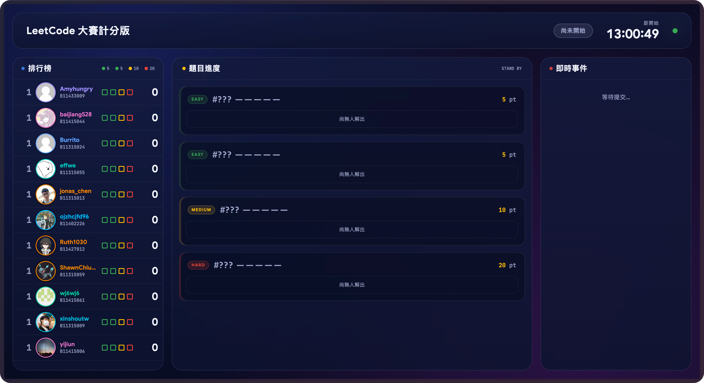
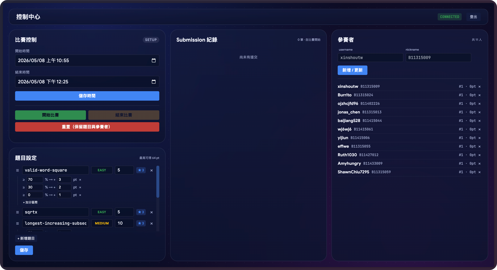

<div align="center">


**LeetCode x Scoreboard** — 即時計分轉播系統

[](https://fastapi.tiangolo.com)
[](https://www.python.org)  

[](https://react.dev)
[](https://vitejs.dev)
[](https://www.typescriptlang.org)
[](https://workers.cloudflare.com)

</div>

## 總覽

LeetCoard 是即時排行榜與投影轉播系統，給社課 / 比賽當天用。後端 FastAPI 持續輪詢 LeetCode submissions，全程 SSE 推播。

底層由 asyncio polling worker、scheduler、scoring engine 與原子化 JSON store 組成；伺服器端為唯一計分權威，前端不計分，僅消費 `/api/snapshot` 與 SSE 事件。

### 介面預覽

**公開計分板（投影畫面）**



**管理員 Dashboard**



### 特色

- **即時推播** — SSE，連線送 `snapshot` 後增量推 `leaderboard_update` / `submission_event` / `contest_status`，斷線自動重連並重抓 snapshot
- **計分引擎** — 比賽期間第一次 AC 加基礎分，可選 beat-% 多階加分（進步時補差額），時間外 AC 不計分，submission 去重
- **自動排程** — `setup → running → ended` 由 scheduler 依時間自動 transition，不需要管理員精準按秒
- **寬限期收尾** — 比賽結束後續輪詢 `POST_END_GRACE_SEC` 秒，補抓 `submittedAt` 在期間內的延遲 AC
- **原子化持久化** — `data/contest.json` 以 `tmp + os.replace` 寫入並保留 `.bak`，重啟後狀態完整恢復
- **管理員後台** — 題目 / 參賽者 / 時間設定、批量匯入、推播刷新、polling 健康狀態
- **多 cookie 輪替** — `LEETCODE_SESSIONS` 支援逗號分隔，自動 round-robin + cooldown

## 前置需求

| 項目 | 需求 |
|------|------|
| Python | 3.11+ |
| Node.js | 20+ |
| LEETCODE_SESSION cookie | 選填（取得 beat-% 需要） |

## 安裝

```bash
git clone https://github.com/xinshoutw/leetcoard.git
cd leetcoard

# 後端
python3 -m venv .venv
source .venv/bin/activate
pip install -e '.[dev]'
cp .env.example .env   # 至少填 ADMIN_TOKEN

# 前端
cd frontend
npm install
```

## 快速開始

```bash
# 後端（root 目錄）
uvicorn app.main:app --reload --port 8080

# 前端（frontend/）
npm run dev    # http://localhost:5173
```

打開 [`http://localhost:5173/`](http://localhost:5173/) 看計分板，[`/dashboard`](http://localhost:5173/dashboard) 進管理員介面。健康檢查：[`http://localhost:8080/api/health`](http://localhost:8080/api/health) 應回 `{"ok":true}`。

## 專案結構

```
leetcoard/
├── app/                          # FastAPI 後端
│   ├── main.py                   # ASGI entrypoint、SSE endpoints
│   ├── api/                      # REST routes（public / admin）
│   ├── core/
│   │   ├── scoring.py            # 計分引擎（基礎分 + beat-% bonus）
│   │   ├── ranking.py            # 排名（分數 → 達到時間 tiebreak）
│   │   ├── scheduler.py          # setup → running → ended 自動轉換
│   │   ├── polling.py            # asyncio worker + cookie round-robin
│   │   ├── broadcaster.py        # SSE fanout（public / admin 分流）
│   │   └── store.py              # 原子化 JSON 持久化（.tmp + .bak）
│   ├── clients/
│   │   └── leetcode.py           # httpx client to leetcode-api-pied
│   └── models.py                 # Pydantic schemas
│
├── frontend/                     # React + Vite SPA
│   ├── src/
│   │   ├── pages/
│   │   │   ├── Scoreboard.tsx    # 公開計分板（投影用）
│   │   │   └── Dashboard.tsx     # 管理員後台
│   │   ├── components/
│   │   │   ├── ProblemBoard.tsx  # 題目卡片牆
│   │   │   ├── ProblemCard.tsx   # 單題卡（含 frontend_id）
│   │   │   ├── PlayerLane.tsx    # 火柴人軌道（Framer Motion）
│   │   │   └── dashboard/        # ProblemsPanel / PlayersPanel / TimePanel
│   │   ├── hooks/
│   │   │   ├── useSnapshot.ts    # 初始 snapshot + SSE 對齊
│   │   │   └── useEventStream.ts # EventSource + 自動重連
│   │   └── lib/
│   │       ├── api.ts            # backend client
│   │       └── leetcode.ts       # 直連 LeetCode 取題（frontend_id）
│   ├── wrangler.jsonc            # Cloudflare Workers 部署設定
│   └── vite.config.ts
│
├── data/
│   ├── contest.json              # 持久化狀態（執行時產生）
│   └── contest.json.bak          # 自動備份
│
├── tests/                        # pytest（scoring / ranking / persistence）
└── pyproject.toml
```

## 計分規則

每位參賽者對每題：

1. **基礎分** — 第一次在比賽時間內 AC，加上題目設定的 `points`
2. **Beat-% 加分** — 可選，每題可設多階區間（例：`≥95% → +3`、`≥80% → +2`、`≥60% → +1`）。第一次 AC 套用對應階級，之後同題進步到更高階只補加差額
3. **時間外 AC 不計分** — `submittedAt` 落在 `start_time` 與 `end_time` 之外一律不算（仍記錄成事件）
4. **去重** — 同一個 `submission_id` 只計一次

排名：分數高優先；同分以「達到目前分數的時間」較早者勝出。

## 開發

```bash
# 後端測試（19 個 scoring / ranking / bonus / persistence 測試）
pytest -q

# 前端型別檢查
cd frontend && npm run lint

# 前端建置
npm run build
```

## 部署

### 後端（自架）

任何能跑 Python 3.11+ 且有 stable filesystem 的機器。對外用 nginx 或 cloudflared 反代，注意：

- SSE 需要 `proxy_buffering off;` 並把 `proxy_read_timeout` 拉長
- `.env` 的 `CORS_ORIGINS` 寫入前端網域

範例 systemd unit：

```ini
[Service]
WorkingDirectory=/srv/leetcoard
EnvironmentFile=/srv/leetcoard/.env
ExecStart=/srv/leetcoard/.venv/bin/uvicorn app.main:app --host 0.0.0.0 --port 8080
Restart=always
```

### 前端（Cloudflare Workers）

```bash
cd frontend
npm install
npm run build
npx wrangler deploy
```

`wrangler.jsonc` 處理 SPA fallback；前端透過 `VITE_API_BASE` 直連 API origin（不走 Worker proxy，避免無限轉發）。

## 環境變數

| Var | 預設 | 說明 |
| --- | --- | --- |
| `ADMIN_TOKEN` | `change-me` | dashboard 登入用，部署前必換 |
| `LEETCODE_SESSIONS` | `""` | LEETCODE_SESSION cookie，逗號分隔多個 |
| `LEETCODE_API_BASE` | `https://leetcode-api-pied.vercel.app` | upstream API |
| `DATA_DIR` | `./data` | JSON 持久化資料夾 |
| `POLL_INTERVAL_SEC` | `5` | 每位使用者輪詢間隔 |
| `POLL_RECENT_LIMIT` | `5` | 每次輪詢取的 submission 筆數 |
| `POLL_JITTER` | `0.2` | 抖動，避免同步突發 |
| `POST_END_GRACE_SEC` | `90` | 結束後仍輪詢的寬限期 |
| `LEETCODE_HTTP_TIMEOUT_SEC` | `10` | httpx 超時 |
| `CORS_ORIGINS` | `*` | 逗號分隔，正式環境填具體網域 |

## 比賽流程

1. 填 `LEETCODE_SESSIONS`（沒填也可跑，只是不會抓到 beat-% bonus）
2. 確認 `ADMIN_TOKEN` 已換成長隨機字串
3. dashboard：
   - 設定題目（每題可選 beat-% 加分區間）
   - 批量新增參賽者（每行 `username,student_id`）
   - 設定開始 / 結束時間
   - 到時間自動轉 `running`，要提早結束按「結束比賽」
4. 比賽中可用「推播刷新」強制重新對齊所有 SSE 客戶端
5. 異常時 `/api/admin/snapshot` 永遠拿得到完整狀態；後端重啟會從 JSON 恢復

## 已知假設

- 一場 2 小時 / 30–60 人 / 一次性活動
- 一個 token 進 dashboard，沒有多管理員角色
- 比賽中題目順序鎖定
- 同分以「達到該分數時間」決勝
- 30–60 人 DOM + Framer Motion 沒問題；超過約 80 人前端自動橫向收緊間距
- 沒有「賽前是否已 AC 過該題」檢查（需要參賽者本人 cookie，不可行）

## 貢獻

歡迎 PR 與 Issue。送出前請確認：

1. 後端 `pytest -q` 通過
2. 前端 `npm run lint` 與 `npm run build` 通過
3. 分支以 `feature/...` 或 `fix/...` 命名
4. PR 目標分支為 `main`

## 授權

本專案採用 [MIT License](LICENSE) 授權。
